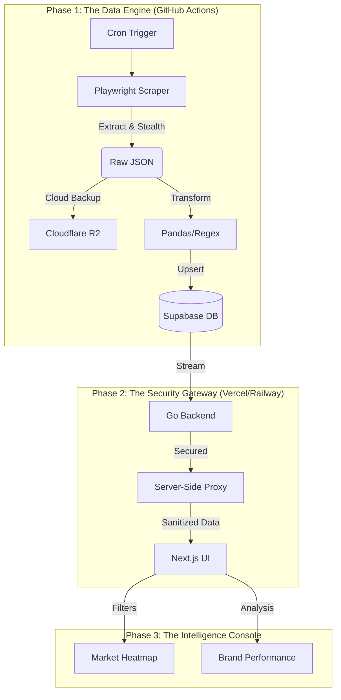

# TikTok Shop Market Intelligence Platform
*From Raw Data to Strategic Insight: A Story of Resilient Engineering*

---

## 🌟 The Narrative
In the fast-paced world of E-commerce, data is often scattered, volatile, and protected by sophisticated bot defenses. This project is a production-grade market intelligence solution that transforms raw TikTok Shop data into a secure, high-fidelity analytical console.

---

## 🏗 Full-Stack Architecture
The system is built as a series of specialized layers, each solving a specific engineering or security challenge.

---

## ⚙️ The ETL Engine (Data Engineering)
*   **Intelligent Extraction**: Using **Playwright (Python)** with Stealth configurations, the scraper mimics human patterns to navigate Tokopedia’s Personal Care section.
*   **Decoupled Backup**: Every scrape is mirrored to **Cloudflare R2**, ensuring a permanent "source of truth" beyond the database.
*   **Normalization & Deduplication**: URLs are cleaned of tracking tokens before hashing (SHA-256), ensuring price updates are tracked without duplicate records.
*   **Fail-Fast Resilience**: Strict error propagation ensures that if a proxy fails, the system halts immediately to prevent data corruption.

## 🛡 Security & DevOps
*   **Zero-Trust Frontend**: A **Server-Side Proxy** in Next.js moves API authentication to the server, hiding secrets from the browser's Network tab.
*   **Database Governance**: **Row Level Security (RLS)** in PostgreSQL restricts data access solely to the API's service role.
*   **Automated ROI**: Optimized GitHub Actions with failure-only artifact uploads and 24h retention to minimize storage overhead.

## 📊 The Analytical Console
*   **KPI Command Center**: Instant visibility into Total Volume, Pricing Trends, and Discounts.
*   **Market Share Distribution**: Visualizing brand dominance and niche concentration.
*   **Strategic Pricing Heatmap**: Identifying the "Sweet Spot" where price meets peak consumer satisfaction.

---

## 🛠 Tech Stack
- **Backend**: Go (Chi), PostgreSQL (Supabase)
- **ETL**: Python, Playwright, Pandas, Boto3 (R2)
- **Frontend**: Next.js 14, TypeScript, Tailwind CSS, Recharts
- **DevOps**: GitHub Actions, Railway, Vercel

---

## 🚀 Getting Started

### Prerequisites
- Python 3.10+, Go 1.22+, Node.js 18+
- Supabase Project & Cloudflare R2 Bucket

### Quick Start
1. **Setup Env**: Copy `.env.example` to `.env` and fill in your credentials.
2. **Setup ETL**: `pip install -r requirements.txt`
3. **Setup Services**:
   - Backend: `cd backend && go mod download`
   - Frontend: `cd frontend && npm install`

### Running Locally
- **Run ETL**: `python etl/run_etl.py`
- **Start Backend**: `cd backend && go run ./cmd/server`
- **Start Frontend**: `cd frontend && npm run dev`

---

## 🌐 Deployment
Full instructions available in [DEPLOYMENT.md](./DEPLOYMENT.md). 
- **Backend**: Railway.app
- **Frontend**: Vercel
- **ETL**: GitHub Actions (Schedule: Hourly)
